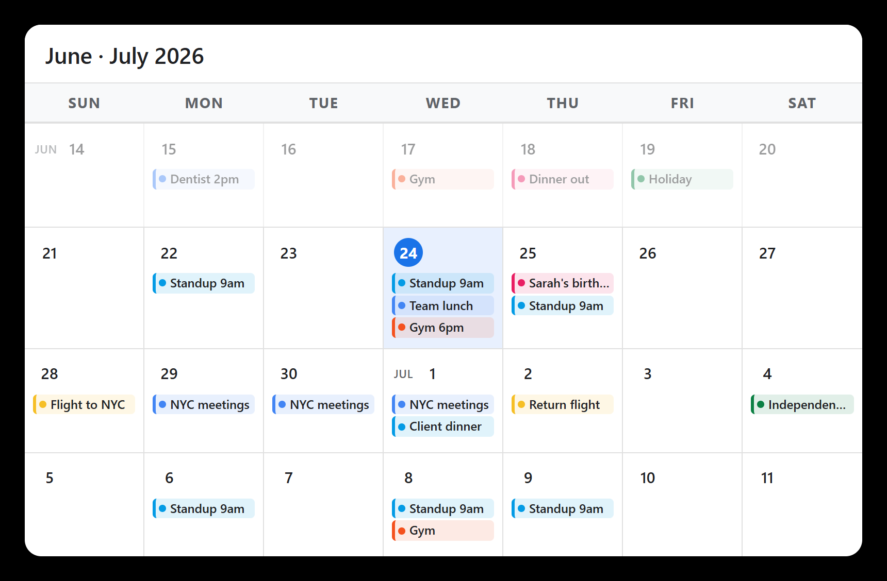

# MMM-MyGCalendar

A polished month-view calendar module for [MagicMirror²](https://magicmirror.builders/) that connects directly to Google Calendar via iCal URL.

Displays a rolling 4-week window: **1 past week · current week · 2 future weeks**.



- Click any **event chip** → full event detail modal
- Click any **date number** → day-view modal listing all events for that day (click any event there for full detail with a ← back button)
- Click the **"+N" badge** (top-right corner of a date square) → same day-view modal
- Every date square reserves a fixed height for `maxEventsPerDay` events, so the calendar's overall height stays predictable regardless of how many events land on a given day

---

## Installation

```bash
cd ~/MagicMirror/modules
git clone https://github.com/johnster000/MMM-MyGCalendar.git
cd MMM-MyGCalendar
npm install
```

---

## Update

```bash
cd ~/MagicMirror/modules/MMM-MyGCalendar
git pull
npm install
```

---

## Getting Your Google Calendar iCal URL

1. Open [Google Calendar](https://calendar.google.com) in a browser.
2. Click the **⋮** next to the calendar name → **Settings and sharing**.
3. Scroll to **"Integrate calendar"**.
4. Copy the **"Secret address in iCal format"**:
   ```
   https://calendar.google.com/calendar/ical/you%40gmail.com/private-XXXXXX/basic.ics
   ```
5. Paste it into the `url` field below.

> **Note:** This URL gives full read access to your private calendar — treat it like a password.

---

## Configuration

```javascript
{
  module: "MMM-MyGCalendar",
  position: "top_bar",
  config: {
    calendars: [
      {
        name: "Personal",
        url: "https://calendar.google.com/calendar/ical/you%40gmail.com/private-HASH/basic.ics",
        color: "#4285F4"
      },
      {
        name: "Work",
        url: "https://calendar.google.com/calendar/ical/work%40example.com/private-HASH/basic.ics",
        color: "#0F9D58"
      }
    ],
    colorRules: [
      { keyword: "standup",        color: "#039BE5" }, // Peacock
      { keyword: "birthday",       color: "#E91E63" }, // Pink
      { keyword: "gym|workout",    color: "#F4511E" }, // Tangerine
      { keyword: "holiday",        color: "#0B8043" }, // Basil
      { keyword: "flight|travel",  color: "#F6BF26" }, // Banana
    ]
  }
},
```

### All Options

| Option               | Default        | Description                                                      |
|----------------------|----------------|------------------------------------------------------------------|
| `calendars`          | `[]`           | Array of calendar sources (see above)                            |
| `calendars[].name`   | `"Calendar"`   | Display name shown in modals                                     |
| `calendars[].url`    | —              | iCal URL from Google Calendar settings                           |
| `calendars[].color`  | `"#4285F4"`    | Fallback hex color used when the event has no individual color   |
| `updateInterval`     | `900000` (15m) | How often to re-fetch calendar data (ms)                         |
| `weekStartsOnMonday` | `false`        | Set `true` for Mon–Sun week layout                               |
| `backgroundColor`    | `"#ffffff"`    | Background color of the calendar card                            |
| `pastWeekOpacity`    | `0.45`         | Opacity of the past-week row (0 = invisible, 1 = full)           |
| `maxEventsPerDay`    | `3`            | Max chips shown per day cell (also sets the fixed slot height of every date square; overflow shown as a clickable "+N" corner badge) |
| `fullWidth`          | `false`        | Set `true` to remove border-radius and shadow for a flush edge-to-edge look |
| `showHeader`         | `true`         | Set `false` to hide the month-range header bar above the calendar grid |
| `colorRules`         | `[]`           | Keyword-based color overrides — see below                        |
| `debug`              | `false`        | Log raw event properties to the MagicMirror console (useful for troubleshooting) |

### Per-event colors with `colorRules`

Google Calendar's iCal export does not include individual event colors — those only exist in the Google Calendar API (which requires OAuth). The iCal feed only carries the calendar-level color set in `calendars[].color`.

To color specific events, use `colorRules`. Each rule matches against the event title (case-insensitive) and applies a hex color. Rules are checked in order — the first match wins.

```javascript
config: {
  colorRules: [
    { keyword: "standup",    color: "#039BE5" }, // Peacock blue
    { keyword: "birthday",   color: "#E91E63" }, // Pink
    { keyword: "gym|workout",color: "#F4511E" }, // Tangerine — regex OR
    { keyword: "holiday",    color: "#0B8043" }, // Basil green
    { keyword: "flight|travel", color: "#F6BF26" }, // Banana yellow
  ],
  calendars: [...]
}
```

The `keyword` value is treated as a **case-insensitive regular expression**, so you can use `|` for OR, `^` to match the start, etc.

Color priority order: iCal `COLOR` property (non-Google sources) → `colorRules` match → `calendars[].color` fallback.

### Suggested colors

| Google name  | Hex       |
|--------------|-----------|
| Tomato       | `#D50000` |
| Flamingo     | `#E67C73` |
| Tangerine    | `#F4511E` |
| Banana       | `#F6BF26` |
| Sage         | `#33B679` |
| Basil        | `#0B8043` |
| Peacock      | `#039BE5` |
| Blueberry    | `#3F51B5` |
| Lavender     | `#7986CB` |
| Grape        | `#8E24AA` |
| Graphite     | `#616161` |

### Suggested fallback calendar colors

| Color        | Hex       |
|--------------|-----------|
| Google Blue  | `#4285F4` |
| Google Green | `#0F9D58` |
| Google Red   | `#DB4437` |
| Purple       | `#7986CB` |
| Teal         | `#009688` |
| Pink         | `#E91E63` |
| Amber        | `#F4B400` |

---

## Interactions

| Tap target          | Result                                              |
|---------------------|-----------------------------------------------------|
| Event chip          | Event detail modal (title, time, location, notes)   |
| Date number         | Day-view modal — all events for that day            |
| "+N" corner badge   | Day-view modal — all events for that day            |
| Event in day modal  | Event detail modal with ← back to day view          |
| Backdrop / Esc      | Close modal                                         |
